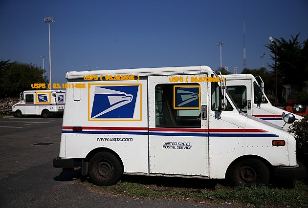
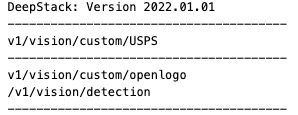

# DeepStack_OpenLogo



This repository provides a custom DeepStack model that has been trained detecting ONLY the **USPS logo**. This was created after I discovered that the Deepstack OpenLogo custom model I was using did not contain USPS. The owner of that repo suggested that we create our own, so I decided to give it a shot!

In my use case, I have a Blue Iris clone of my main house cameras that is setup to NOT record. It's only set up to alert if it sees a car, truck, van or bus. The alert image is then sent over MQTT to node-red. It's then read in, and thrown against OpenLogo to see if it matches fedex, ups, amazon or dhl. If nothing is reported back, then I'll throw it against this USPS custom object end point. Essentially it's scanning each alert image multiple times, but its quick enough in processing that it should alert me when it sees the logo. 

The main goal? My wife mails back her empty soda stream cannisters and then new ones are sent to us. Instead of having to head to a post office, its easier for us to catch our mail carrier and hand them the package when they're outside. Happy wife...

- **Create API and Detect Logos**
- **Discover more Custom Models**
- **Train your own Model**


# Create API and Detect Logos

The only logo in the model is "USPS". So this is a unique custom object endpoint that is only used for USPS detection. The way I understand it (which honestly, I just followed the directions), the AI training is based off of the images provided and the portion of the images that I tag with class names. So I could have done "truck" or "van" or "trailer" along with the USPS logo, but I wanted to keep things simple. 

To start detecting, follow the steps below

- **Install DeepStack:** Install DeepStack AI Server with instructions on DeepStack's documentation via [https://docs.deepstack.cc](https://docs.deepstack.cc/index.html#installation)
- **Download Custom Model:** Download the trained custom model `USPS.pt` via  [this link](https://github.com/sstratoti/DeepStack_USPS/releases/download/v1/USPS.pt). Create a folder on your machine and move the model to this folder.

    E.g A path on Windows Machine `C\Users\MyUser\Documents\DeepStack-Models`, which will make your model file path `C\Users\MyUser\Documents\DeepStack-Models\USPS.pt`

- **Run DeepStack:** To run DeepStack AI Server with the custom USPS model, run the command that applies to your machine as detailed on DeepStack's documentation [linked here](https://docs.deepstack.cc/custom-models/deployment/index.html#starting-deepstack).

    E.g

    For a Windows version, you run the command below
    ```bash
    deepstack --MODELSTORE-DETECTION "C\Users\MyUser\Documents\DeepStack-Models" --PORT 80
    ```

    For a Linux machine
    ```bash
    sudo docker run -v /home/MyUser/Documents/DeepStack-Models -p 80:5000 deepquestai/deepstack
    ```
    Once DeepStack runs, you will see a log like the one below in your `Terminal/Console`

    

    That means DeepStack is running your custom `USPS` model and now ready to start detecting logos in images via the API enpoint `http://localhost:80/v1/vision/custom/USPS` or `http://your_machine_ip:80/v1/vision/custom/USPS`

- **Detect Logo in image:** You can detect logos in an image by sending a `POST` request to the url mentioned above with the paramater `image` set to an `image` using any proggramming language or with a tool like POSTMAN. For the purpose of this repository, we have provided a sample Python code below.

    - A sample image can be found in `images/usps.jpg` of this repository


    

    - Install Python and install the **DeepStack Python SDK** via the command below
        ```bash
        pip install deepstack_sdk
        ```
    - Run the Python file `detect.py` in this repository.

        ```bash
        python detect.py
        ```
    - After the code runs, you will find a new image in `images/usps_new.jpg` with the detection visualized, with the following results printed in the Terminal/Console.

        ```
        Name: USPS
        Confidence: 0.93151146
        x_min: 74
        x_max: 102
        y_min: 189
        y_max: 210
        -----------------------
        Name: USPS
        Confidence: 0.9639365
        x_min: 181
        x_max: 288
        y_min: 172
        y_max: 246
        -----------------------
        Name: USPS
        Confidence: 0.9687089
        x_min: 356
        x_max: 408
        y_min: 176
        y_max: 221
        -----------------------
        ```

        
   


# Discover more Custom Models

Please visit the OpenLogo repository that started this whole thing. Almost all of this readme and code was copied from there. [https://github.com/OlafenwaMoses/DeepStack_OpenLogo](https://github.com/OlafenwaMoses/DeepStack_OpenLogo) .

For more custom DeepStack models that has been trained and ready to use, visit the Custom Models sample page on DeepStack's documentation [https://docs.deepstack.cc/custom-models-samples/](https://docs.deepstack.cc/custom-models-samples/) .

# Train your own Model

If you will like to train a custom model yourself (this is what I did!), follow the instructions below.

- **Prepare and Annotate:** Collect images on and annotate object(s) you plan to detect as [ detailed here ](https://docs.deepstack.cc/custom-models/datasetprep/index.html)
- **Train your Model:** Train the model as [detailed here](https://docs.deepstack.cc/custom-models/training/index.html)